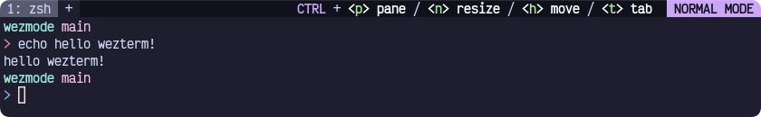
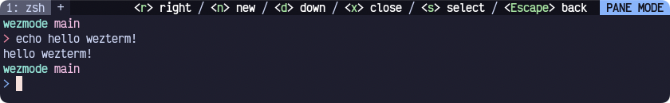
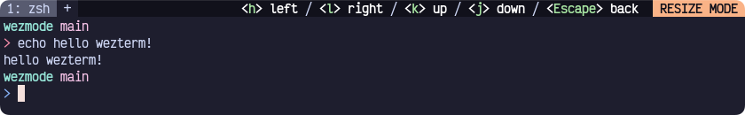

# Wezmode
*Modal keybinds and prompts for wezterm*

>Note: I am not a lua dev, please feel free to suggest improvements.

## What is it?
A super simple set of helper methods (**plugin?**) to create custom "modes" using the `key_tables` functionality of wezterm.

Here's a few of my modes:




## Limitations
Using this plugin, we decide on a modifier and a set of keys that will trigger certain modes.
By default, `CTRL` is the modifier. There is currently no way to have different modes under different modifiers.

There is currently no way to have nested modes. This feature is on the roadmap.

## Installation
To install this script, place [wezmode.lua](http://TODO!!) in your [wezterm config directory](https://wezfurlong.org/wezterm/config/files.html). This is usually `$HOME/.config/wezterm`

Once the script is installed. Sweet nothing will happen. Let's move on to usage.

## Usage
```lua
-- wezterm.lua
local wezterm = require("wezterm")

-- 1. Import wezmode into your `wezterm.lua` config.
local wezmode = require("wezmode")

-- 2. Call the setup function to generate your keymaps,
     -- key tables and mode texts (The text in the status bar)
wezmode.setup({
  {
     name = "pane", -- the name that will show in the status bar for the mode
     key = "p", -- the key you'll use with your modifier to enter the mode
     modeColor = "#89b4fa", -- the color of the mode indicator
     keyTable = {
       {
          key = "r",
          desc = "right",
          action = wezterm.action.SplitHorizontal({ domain = "CurrentPaneDomain" })
        },
        -- more keybinds here
    }
  },
  -- some more modes here
})

-- 3. Set up the right status text to use our modes
wezmode.handleRightStatusUpdate()

-- 4. Add our modes to our wezterm config
return {
    -- other config options
    keys = wezmode.getKeys(),
    key_tables = wezmode.getKeyTables(),
}
```

See the next section (Advanced usage) for more complex configurations.

## Advanced usage
### Config
An optional config can be supplied as the second argument for `wezmode.setup`
The default config is as follows:
```lua
{
  modifier = "CTRL", -- follows the same modifier syntax as wezterm key maps
  hintSeparator = "/", -- the character that separates each hint
  normalModeColor = "red", -- the color to use for the normal mode indicator
  hintColor = "green", -- the color to use for the key hints
  modeTextColor = "black", -- the text color for the mode indicators
  textColor = "white", -- the basic text color
}
```
For example if we want to use `Ctrl & Alt` for our modifier:
```lua
wezmode.setup({
  -- modes here as usual
},
{
  modifier = "CTRL|ALT"
})
```

### Merging with existing keymaps
By using only `wezmode.getKeys` and `wezmode.getKeyMaps` to set our keybinds, we are limited to using bindings only defined in our `wezmode.setup` call. To use other key maps we can use `wezmode.extendTable`.
For example if we wanted to use ALT+Arrow Keys to navigate between panes as well as use our mode config:
```lua
-- wezterm.lua
return {
  -- the rest of your config...
  keys = wezmode.extendTable({
        { mods = "ALT", key = "LeftArrow", action = wezterm.action { ActivatePaneDirection = "Left" } },
        { mods = "ALT", key = "RightArrow", action = wezterm.action { ActivatePaneDirection = "Right" } },
        { mods = "ALT", key = "UpArrow", action = wezterm.action { ActivatePaneDirection = "Up" } },
        { mods = "ALT", key = "DownArrow", action = wezterm.action { ActivatePaneDirection = "Down" } },
     }, wezmode.getKeys()),
  -- extendTable can also work with `key_tables`
}
```

### Manually setting the status
If you want to get the text used in the status to set it manually we can use `wezmode.getModeText`.

For example let's remove the call to `wezmode.handleRightStatusUpdate` and replace it with:
```lua
wezterm.on('update-right-statuis', function(window)
    window:set_right_status(wezmode.getModeText(window:active_key_table() or "normal"))
end)
```

This will behave the same as `wezmode.handleRightStatusUpdate` but allows us to extend the behavior or use the mode text in other ways.
